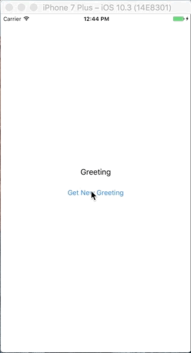

# Random Greeting

<p align="center">
    
</p>

This is end-to-end application written in Swift. [Kitura][] is used for the server.

[Kitura]: https://github.com/IBM-Swift/Kitura

## How to run the server

```bash
cd RandomGreetingServer
swift build
.build/debug/RandomGreetingServer
```
